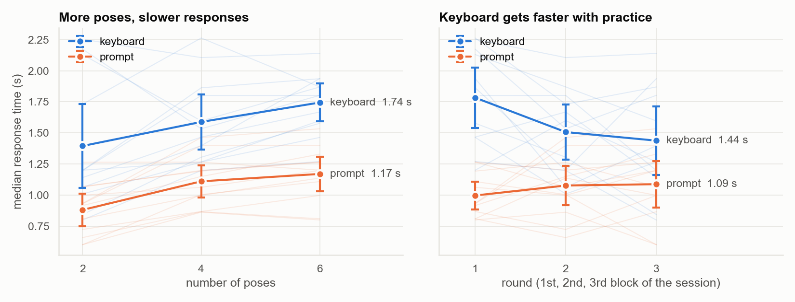
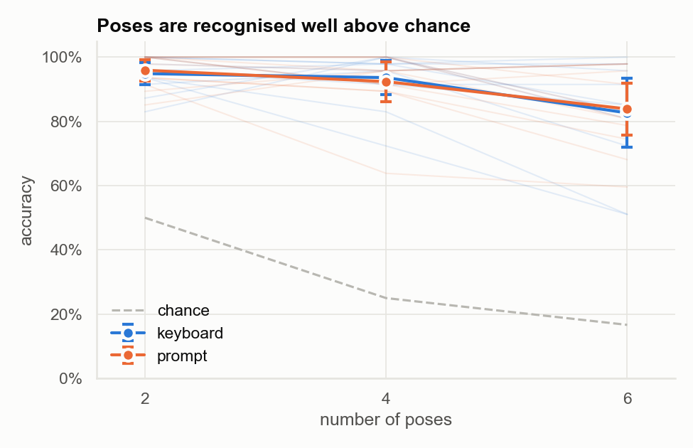

# Rock-Paper-Speller

Typing with hand poses instead of keys. A webcam and [MediaPipe Hand Landmarker](https://developers.google.com/mediapipe/solutions/vision/hand_landmarker) track the hand. Each person chooses their own set of hand poses, and a classifier trained on a short calibration recognises them. To "type" a letter, the user makes the pose shown in that key's colour on an on-screen keyboard.

The project was built and run as a user study in spring 2024: 12 participants, each tested with 2, 4 and 6 poses.

## Results

Each participant calibrated 6 personal poses. They then did two tasks at each pose count (2, 4, 6):

- **Prompt:** copy the pose shown on screen, 47 times.
- **Keyboard:** type a 47-letter phrase. Each key is outlined in a colour that maps to one of the active poses, and the colours are reshuffled for every letter.

|                   | 2 poses | 4 poses | 6 poses |
|-------------------|---------|---------|---------|
| Prompt time       | 0.88 s  | 1.11 s  | 1.17 s  |
| Keyboard time     | 1.40 s  | 1.59 s  | 1.74 s  |
| Prompt accuracy   | 96%     | 92%     | 84%     |
| Keyboard accuracy | 95%     | 94%     | 83%     |

*Mean across 12 participants of each participant's median response time (prompt shown to space press) and classification accuracy. Chance accuracy is 50%, 25% and 17%.*



- **More poses take longer.** Compared with 2 poses, keyboard responses were 0.19 s slower with 4 poses and 0.35 s slower with 6, after accounting for practice and individual differences.
- **Keyboard typing improves quickly with practice.** Participants were 0.28 s faster in their second block and 0.35 s faster in their third. The prompt task showed no such improvement.
- **Poses are recognised well above chance.** Accuracy stays above 90% up to 4 poses and drops to about 83% at 6, where two participants fell to around 50%.
- **4 poses is the best trade-off for the keyboard.** Combining speed and accuracy as an information transfer rate gives about 63 bits/min with 4 poses, against 36 with 2 and 57 with 6.



### Caveats

- Accuracy was computed **afterwards**, not live. During the study each trial was ended with a space press. The pose is read from the last ~0.33 s of hand tracking before that press, using a classifier trained on the participant's own calibration and choosing only among the poses active in that block.
- Response time runs until the space press, so it includes the time to press the key.
- All participants typed the same phrase with the same seeded colour assignments.

The full analysis, including per-participant results and how sensitive accuracy is to the analysis choices, is in [`experiment/Results.ipynb`](experiment/Results.ipynb).

## Repository layout

| Path | What it is |
|------|------------|
| [`experiment/`](experiment/) | **The study**: the stage 1–3 programs, the 2024 data and the analysis. See its [README](experiment/README.md). |
| `hand_landmarker.task` | MediaPipe hand landmark model used by all the programs |
| `beep-2.mp3` | Cue sound used during calibration |
| `calibration.py`, `constants.json`, `poses/` | Early prototype (Feb 2024): calibration against a fixed set of stock poses. Writes to `results/`. |
| `graph-results-pipeline.ipynb` | Early prototype: parses a `results/` file and plots the normalised hands |
| `keyboard-scratch.py` | Early prototype of the coloured keyboard |
| `multiple_confusion_matrices.pdf` | Confusion matrices from the prototype stage |

## Setup

The code was written for Python 3.9 (Anaconda) on macOS with:

```bash
pip install mediapipe==0.10.9 opencv-python==4.9.0.80 pygame==2.5.2 numpy pandas scipy scikit-learn statsmodels matplotlib seaborn networkx jupyter
```

The programs use the webcam. On macOS, the terminal app you run them from needs camera access (System Settings → Privacy & Security → Camera).

## Presentation

This project was presented at Northeastern University's annual RISE Expo (Spring 2024).

The poster can be found [here](https://drive.google.com/file/d/1SAa8FkxiEywSGVBhTmxUxQs0_kC0NWsj/view?usp=sharing).
